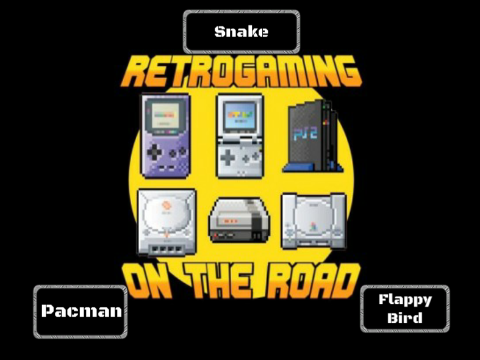

 
 
 <h1>Retrogaming on the Road</h1>
 
A Retrogaming app for Windows made with Unity Engine

&nbsp;

<h2 align="center">Feautures</h2>

- A collection of three different minigames with three different difficulty levels for each
- Background music that varies according to context
- Final ranking with name saving in case a new highscore is obtained

&nbsp;
&nbsp;

<h2 align="center">Screenshots</h2>

 <h3>Main</h3>

 
 
 
 
 
 

&nbsp;

 <h3>Pacman</h3>

| Easy  | Normal | Hard |
| ------------- | ------------- | ------------- |
|  |  |  |
 

&nbsp;

 <h3>Snake</h3>

| Easy  | Normal | Hard |
| ------------- | ------------- | ------------- |
|  |  |  |
 

&nbsp;

 <h3>Flappy bird</h3>

| Easy  | Normal | Hard |
| ------------- | ------------- | ------------- |
|  |  |  |
 

&nbsp;

License
-------

    Copyright 2025 Simone Tugnetti

    Licensed under the Apache License, Version 2.0 (the "License");
    you may not use this file except in compliance with the License.
    You may obtain a copy of the License at

       http://www.apache.org/licenses/LICENSE-2.0

    Unless required by applicable law or agreed to in writing, software
    distributed under the License is distributed on an "AS IS" BASIS,
    WITHOUT WARRANTIES OR CONDITIONS OF ANY KIND, either express or implied.
    See the License for the specific language governing permissions and
    limitations under the License.
